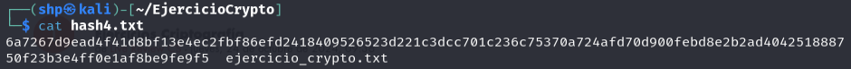

<h1>Hash-Identifier</h1>

<h3>Comprueba con hash-identifier el resultado de cada uno de los ficheros hash obtenidos anteriormente. ¿Acierta en la predicción del tipo de hash?</h3>

 

Debemos copiar los hashes de cada archivo y analizarlo con hash-identifier.

**Hash1.txt**
- `hash-identifier 3244441dda3489d1fa5cdb1cf72342dd`

 

**Hash2.txt**
- `hash-identifier ddf5b509a5a1677fc214ae2bb1795983a55fd4d`

 

**Hash3.txt**
- `hash-identifier 9036a529c6880e1095e412a870426e51423abf670a36ae72e4550dd6791c4cca`

 

**Hash4.txt**
- `hash-identifier 6a7267d9ead4f41d8bf13e4ec2fbf86efd2418409526523d221c3dcc701c236c75370a724afd70d900febd8e2b2ad4042518887`

 
