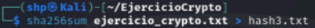
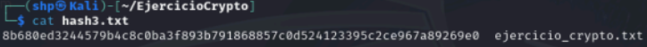

<h1>SHA-256</h1>

<h3>1. Crea un hash MD5 del Crea un hash SHA-256 del fichero ejercicio_crypto.txt y guárdalo como hash3.txt.</h3>

 

Calculamos el hash **SHA-256** del archivo y enviamos el resultado al archivo **hash3.txt**. 

- `sha256sum ejercicio_crypto.txt > hash3.txt`

  

Podemos ver que dentro de **hash3.txt** se encuentra el hash **SHA-256** del contenido de **ejercicio_crypto.txt** y el archivo ejercicio_crypto.txt.

- `cat hash3.txt`

  

